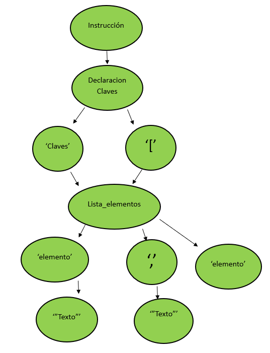
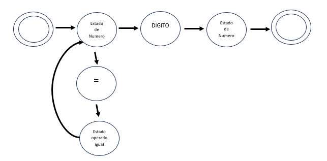
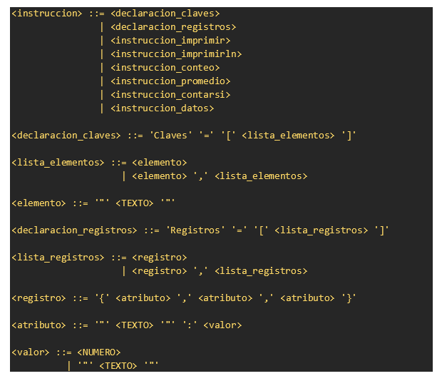

# Manual Técnico para el Analizador Léxico y Sintáctico

---

## 1. Expresiones Regulares para el Analizador Léxico

El Analizador Léxico utiliza expresiones regulares para identificar los patrones léxicos en el código fuente. Estas expresiones regulares se aplican a los caracteres del código fuente para reconocer tokens específicos, como palabras reservadas, números y símbolos especiales. A continuación, se presentan las expresiones regulares utilizadas:

- **Palabras Reservadas y Símbolos Especiales**:
  - **Claves:** `r'Claves'`
  - **Imprimir:** `r'imprimir'`
  - **ImprimirLn:** `r'imprimirln'`
  - **Registros:** `r'Registros'`
  - **Conteo:** `r'conteo'`
  - **Promedio:** `r'promedio'`
  - **ContarSi:** `r'contarsi'`
  - **Datos:** `r'datos'`
  - **Operador Igual:** `r'='`
  - **Corchete Izquierdo:** `r'\['`
  - **Corchete Derecho:** `r'\]'`
  - **Comillas Dobles:** `r'"'`
  - **Coma:** `r','`
  - **Paréntesis Izquierdo:** `r'\('`
  - **Paréntesis Derecho:** `r'\)'`
  - **Punto y Coma:** `r';'`

- **Números Enteros y Decimales**:
  - **Número Entero:** `r'\d+'`
  - **Número Decimal:** `r'\d+\.\d+'`

- **Texto Entre Comillas Dobles**:
  - **Texto:** `r'"[^"]*"'`

---

## 2. Método del Árbol para el Analizador Sintáctico

El Analizador Sintáctico utiliza el Método del Árbol para validar la estructura del código fuente. Este método representa las reglas gramaticales como nodos en un árbol, donde el nodo raíz es la regla de partida y los nodos hijos son las producciones aplicadas. Aquí hay un ejemplo visual:

En este ejemplo, `<instruccion>` es el nodo raíz, y `<declaracion_claves>` es su hijo. `Claves` y `[` son nodos hijos de `<declaracion_claves>`. La producción `<lista_elementos>` tiene tres nodos hijos, representando la estructura de una lista de elementos dentro de claves. Los nodos 'elemento' contienen tokens de texto entre comillas dobles.

## 3. Autómata Finito Determinista (AFD) para el Analizador Léxico

El Analizador Léxico se basa en un AFD para reconocer los tokens en el código fuente. El AFD tiene estados que representan las categorías léxicas, como números, palabras reservadas y símbolos especiales. Las transiciones entre estados están determinadas por los caracteres del código fuente. A continuación, se presenta un ejemplo simplificado del AFD:

En este ejemplo, el AFD comienza en un estado inicial y se mueve a través de los estados según los caracteres del código fuente. Las transiciones se definen para cada categoría léxica, asegurando una clasificación precisa de los tokens.

## 4. Gramática Independiente del Contexto (GIC) para el Analizador Sintáctico
La Gramática Independiente del Contexto (GIC) define las reglas sintácticas del lenguaje de programación. La GIC utilizada en el Analizador Sintáctico define cómo se componen las instrucciones y los elementos dentro de las instrucciones. Aquí hay una versión simplificada de la GIC para el lenguaje:

Esta GIC define la estructura sintáctica del lenguaje, indicando cómo se componen las instrucciones y los elementos dentro de las instrucciones. Los símbolos como `<declaracion_claves>`, `<lista_elementos>`, `<elemento>`, etc., representan las producciones de la gramática.